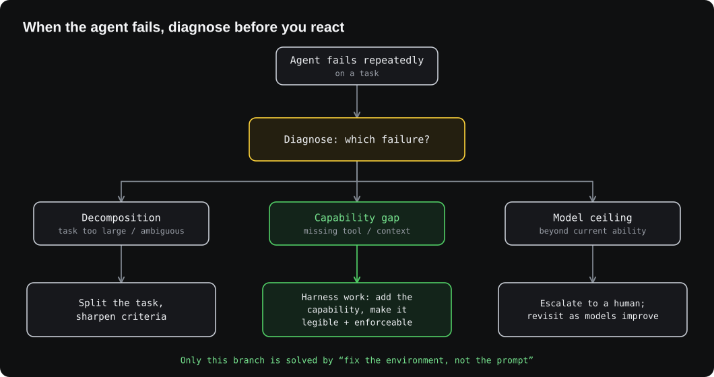
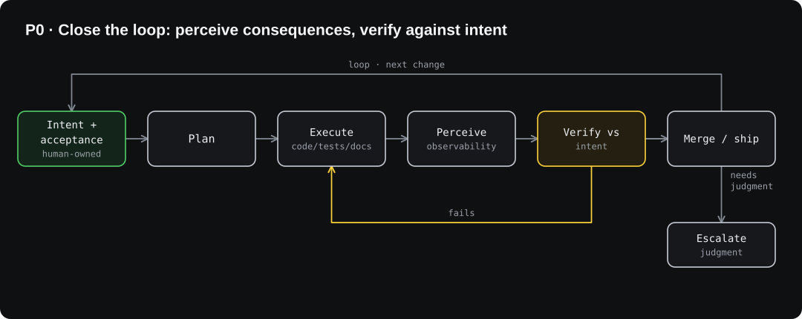
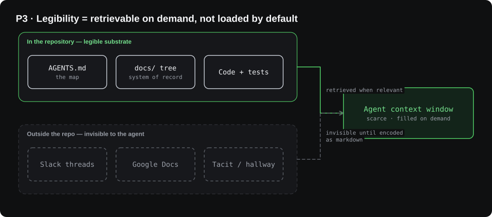
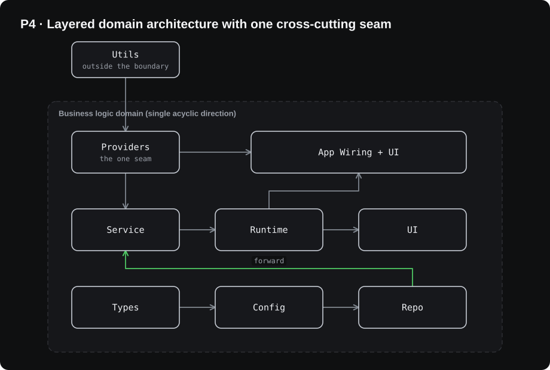
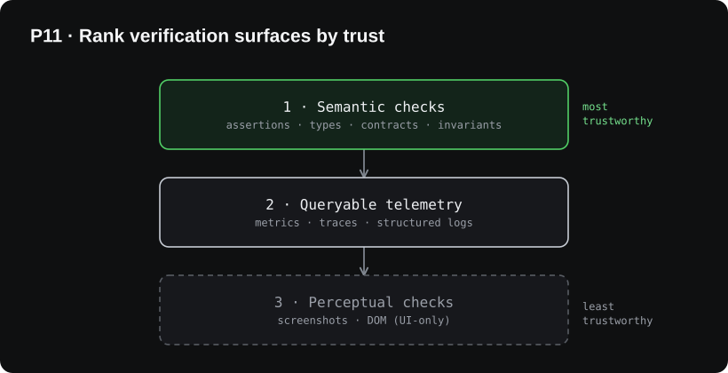
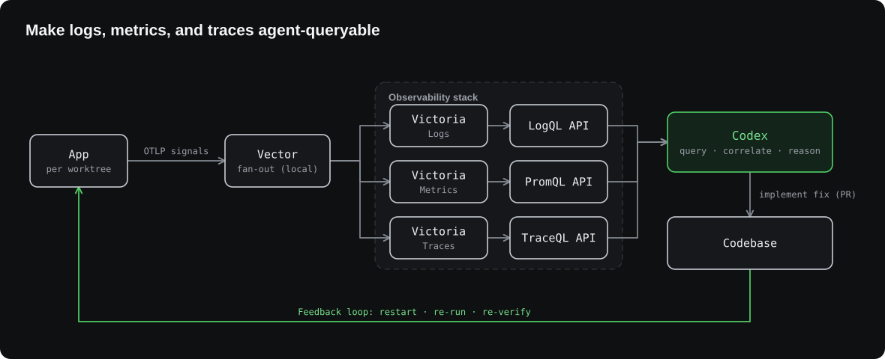
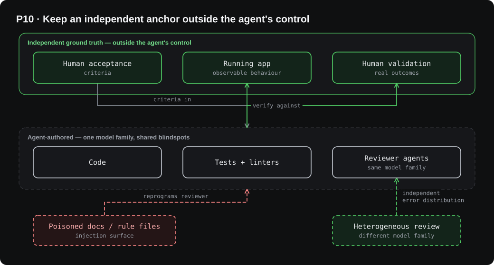
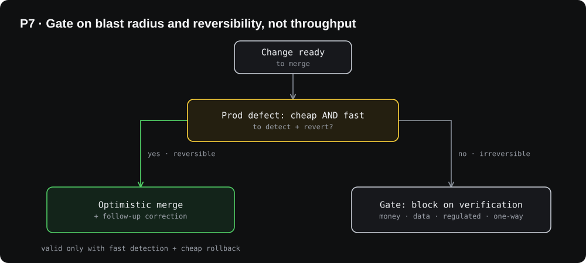
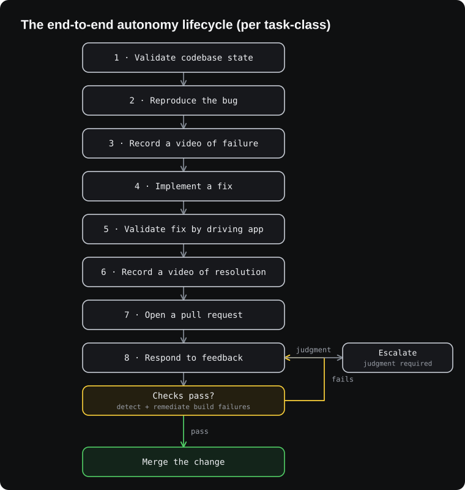
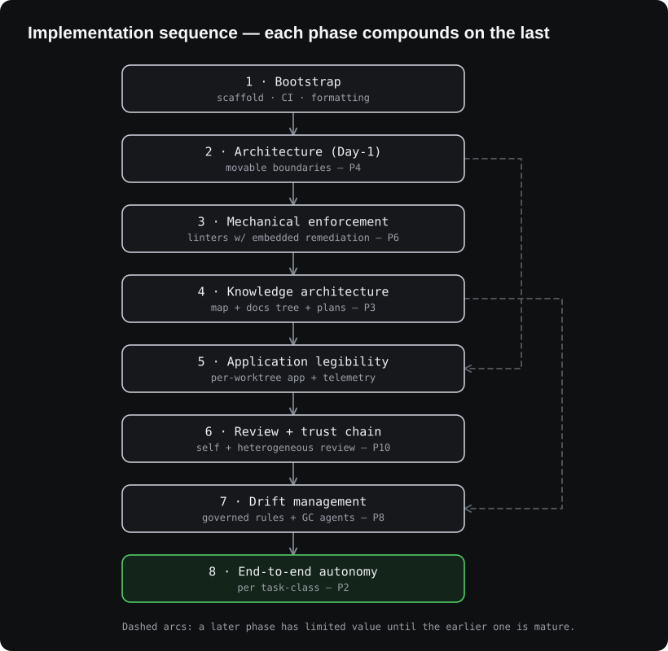

# Agent-First Software Engineering

### A Primer for Building High-Quality Agentic Applications

*Generalizable principles, patterns, and architectural choices for building software with coding agents (Codex, Claude Code, Gemini CLI, Aider, Cursor agent mode, or similar).*

---

## About this document

**Origin.** This primer's factual spine is *Harness engineering: leveraging Codex in an agent-first world* by Ryan Lopopolo (OpenAI Member of Technical Staff), published **February 11, 2026**, which describes a five-month experiment building and shipping an internal-beta SaaS product with **0 lines of manually-written code**, roughly **one million lines of code** across about **1,500 pull requests**, by a team that grew from **three to seven engineers** with throughput increasing rather than plateauing. OpenAI estimated this took roughly one-tenth of the hand-coded time.

Where that experience generalizes cleanly, this primer carries it forward. Where it is an artifact of OpenAI's specific situation (frontier-model access, an elite team, an internal beta with no real-money or regulatory blast radius), it is generalized for teams shipping real products.

**Audience.** Lead engineers, architects, and CTOs building greenfield agentic applications. Brownfield adaptation is an explicit open question (Section 9).

**Diagrams.** Diagrams are SVG (with editable `.excalidraw` sources alongside them in `assets/`), so they render crisply at any zoom in GitHub, Obsidian, GitLab, VS Code, and most markdown viewers, and can be reopened and edited in [Excalidraw](https://excalidraw.com).

---

## Three reframes that govern everything

If a reader internalizes only three things, these are they. Most downstream "rules" are consequences of them, and once you hold them, the contested rules become *dials* you set per task and per risk, not commandments.

1. **The north star is value per unit of human attention, not autonomy.** "Zero human-written code" is a *forcing function*, not a goal. Full autonomy is one point on a curve, optimal for some task-classes and reckless for others.
2. **Verifiable is not correct.** Linters, tests, and structural checks cover *conformance and regression*. They do not cover semantic correctness, authorization logic, concurrency, or product-fit. The system's confidence must never come from blurring these.
3. **Throughput is an effect, not a cause.** You do not earn optimistic merging by being fast; you earn speed *and* optimistic merging together by having fast detection, cheap rollback, and contained blast radius.

---

## Contents

1. [The Paradigm Shift](#1-the-paradigm-shift)
2. [First Principles](#2-first-principles)
3. [The Substrate: Repository as Agent's World](#3-the-substrate-repository-as-agents-world)
4. [Closing the Feedback Loops](#4-closing-the-feedback-loops)
5. [Operating at Throughput](#5-operating-at-throughput)
6. [The Autonomy Progression](#6-the-autonomy-progression)
7. [Anti-Patterns](#7-anti-patterns)
8. [Implementation Sequence](#8-implementation-sequence)
9. [Open Questions and Limits](#9-open-questions-and-limits)
10. [Appendix: Facts and Standing Uncertainties](#10-appendix-facts-and-standing-uncertainties)

---

## 1. The Paradigm Shift

When agents write the code, the engineer's primary job changes. Instead of typing implementation, you **design environments, specify intent, and build the feedback loops the agent operates inside**.

**The operating contract.** Humans own two things and delegate the rest:

- **The specification of intent**: priorities, acceptance criteria, what "correct" means.
- **The acceptance of outcomes**: validating that the result meets that intent.

Everything between (application logic, tests, CI, documentation, observability, internal tooling) is delegable, and the boundary migrates toward agents as your substrate matures.

The popular slogan "humans steer, agents execute" is directionally right but understates that the execution boundary *moves*; the intent-and-acceptance boundary does not.

**The real bottleneck is human attention.** The fixed constraint is human time and judgment, not typing speed, not review throughput. Evaluate design decisions against that single constraint, and measure success as *reliable value delivered per unit of attention*, not as degree of autonomy.

**When the agent fails, diagnose before you react.** The reflex "prompt it harder" is almost always wrong, but "fix the environment" is only the right move for *one* of three failure classes. Diagnose first:



> **Portability note.** Though framed around Codex, these principles apply to any agent that can access a repository, use tools, and respond to prompts. Capability-dependent specifics (multi-hour autonomous runs, agent-to-agent review chains) scale with the agent's ability and your investment, not with brand.

---

## 2. First Principles

Twelve load-bearing principles. The first is the parent of the rest; the others exist to widen and tighten the loop it names.

### The foundation

**P0: Close the loop.** *An agent is autonomous only to the degree it can perceive the consequences of its actions and verify them against intent.* Every other investment (substrate, feedback loops, drift control) exists to widen and tighten this one loop. If a capability investment doesn't help the agent perceive consequences or verify against intent, question whether it is worth making.



The diagram is P0 made concrete. Intent and acceptance are human-owned (P1). "Perceive" is the observability investment (P11). "Verify against intent" must be anchored outside the agent (P9, P10). Everything else in the loop is delegable.

### Theme A: Intent and ownership

**P1: Own the ends, not the means.** Humans own the specification of intent and the acceptance of outcomes; everything between is delegable. An agent must never both define and ratify what counts as success for its own change. The acceptance anchor stays human or external.

**P2: Attention is the budget.** Optimize for reliable value per unit of human attention. Autonomy is a means, tracked **per task-class**, not as a single repo-wide threshold. An agent may be fully autonomous on "fix a bug with a reproduction" and not at all on "choose a new persistence boundary." Hold an autonomy *map* across task-classes rather than asking whether "the repo has crossed a threshold."

### Theme B: The substrate (legibility)

**P3: Retrievable, not resident.** Everything the agent needs must be *retrievable into context at the moment of need*; almost none of it should be permanently loaded. The lever is retrieval quality (a small stable entry point, indexing, search, progressive disclosure), not document volume. "It's in the repo" is necessary but not sufficient; it must be findable when relevant. A 1,000-page manual and an un-indexed wiki fail for the same reason.

**P4: Movable boundaries.** Commit early to a small number of layers with a single enforced *acyclic* dependency direction and one explicit seam for cross-cutting concerns, so "where does this go?" is deterministic. Design those boundaries to move cheaply.

- Your first cut will be wrong, because early domain understanding is wrong; the resolution is not "get it right up front" but to exploit that agents make moving the wall cheap.
- Choose seams that match *your* domain's real structure.

**P5: Boring by default.** Prefer dependencies with stable APIs and strong representation in training data. Reimplementing a small subset in-repo is sometimes right, but it trades a known liability ("opaque upstream behavior") for a different one ("code the model has never seen"), so it must be small, well-documented, and well-tested. **Never reimplement crypto, auth, or security primitives.**

### Theme C: Enforcement

**P6: Mechanize the stable; govern the set.** When a rule is stable, objectively checkable, and costly to violate, promote it from prose to a check (a custom linter, structural test, or CI gate) and embed the remediation in the error message so a failure repairs itself.

- Then treat the invariant set as a *governed, versioned artifact* with an owner, conflict resolution, and a deprecation path.
- Every encoded invariant carries maintenance cost, creates Goodhart pressure (agents optimize to pass the check, not to be correct), and can block a correct novel solution.
- Un-owned rules rot and contradict each other, recreating the monolithic-instruction-file failure in a new location.

### Theme D: Throughput and risk

**P7: Gate on blast radius, not speed.** Gate a change on the *cost and reversibility of a production defect*, not on throughput. Optimistic merging is correct when mean-time-to-detect-and-revert is far below the cost of the defect reaching users, which requires fast detection and cheap rollback. Where a defect is expensive or irreversible (money movement, customer data, regulated paths, one-way doors), gate it, regardless of how fast the agents are.

**P8: Continuous cleanup, conservative auto-merge.** Pay drift down continuously in small increments; capture human taste once as a rule and enforce it on every line thereafter. GC agents should continuously *propose* refactors, but auto-merge only mechanically-trivial, provably behavior-preserving changes (formatting, dead-code removal, mechanical renames). Semantic refactors carry the widest blast radius and the subtlest correctness implications, so they get the same gating as features.

### Theme E: Verification and trust

**P9: Verifiable isn't correct.** Name the classes of correctness that mechanical checks miss (semantic correctness, authorization logic, concurrency and races, product-fit, emergent behavior) and assign each an explicit coverage owner (human spot-check, observable production behavior, staged rollout, property/fuzz tests).

Treating "all checks pass" as "correct" is the single most dangerous error in this entire approach.

**P10: Keep an external anchor.** The acceptance anchor (criteria plus outcome validation) must live outside the agent's control.

- If one agent writes the code, tests, linters, docs, and reviews, the trust chain is self-referential and shares a single model's blindspots, and the repo it treats as ground truth becomes an injection surface.
- Agent-to-agent review raises *recall* on catchable errors and is worth running, but it is not independent correctness validation.
- Reviewing with a *different model family* than authored restores genuinely independent error distributions.

**P11: Semantic over perceptual.** Assertions, typed contracts, and queryable metrics/traces are more trustworthy self-checks than screenshots and DOM snapshots.

Invest in structured, agent-queryable observability first; use UI-driving only for behavior observable solely through the UI, and treat its output as the least-trustworthy signal; perceptual loops are where agents most often "succeed" against the wrong thing.

> **Honest uncertainty.** Two principles here are held less firmly than the rest. **P2's** autonomy-map framing may be over-engineered for a small team (a simple autonomy tier per task-class may suffice); and **P10's** heterogeneous-review claim assumes different model families have meaningfully uncorrelated blindspots, architecturally plausible and worth doing, but there is no hard public evidence quantifying *how* independent those error distributions are. Treat it as a strong hypothesis.

---

## 3. The Substrate: Repository as Agent's World

Everything the agent will ever see lives in the repo. Three substrate decisions are Day-1 work.

### 3.1 Knowledge Architecture

**Don't put everything in `AGENTS.md`.** A monolithic instruction file fails in four predictable ways:

| Failure mode | Why it happens |
|---|---|
| Context is scarce | A giant file crowds out the task, the code, and relevant docs |
| Too much guidance becomes non-guidance | When everything is "important," nothing is; agents pattern-match locally instead of navigating intentionally |
| It rots instantly | Stale rules pile up; humans stop maintaining; the file becomes an attractive nuisance |
| Hard to verify | A single blob resists mechanical checks (coverage, freshness, ownership, cross-links) |

**Use a structured `docs/` tree as the system of record**, with `AGENTS.md` reduced to a small (~100-line) table of contents that points into it. A representative shape:

```
AGENTS.md   ARCHITECTURE.md   DESIGN.md   SECURITY.md   PLANS.md
docs/
├── design-docs/      (index.md, core-beliefs.md, …)
├── exec-plans/       (active/, completed/, tech-debt-tracker.md)
├── generated/        (db-schema.md, …)
├── product-specs/    (index.md, feature specs, …)
└── references/       (library "llms.txt" digests, …)
```

**Plans are first-class artifacts.** Lightweight ephemeral plans for small changes; persistent execution plans with progress and decision logs for complex work. Active plans, completed plans, and known technical debt are all versioned and co-located so the agent operates without external context.

**The governing principle (P3): legibility means *retrievable on demand*, not *loaded by default*.** What the agent cannot retrieve into context while running effectively does not exist for it, exactly as a decision made in a hallway is unknown to a new hire three months later.



**Enforce mechanically.** Custom linters and CI jobs validate that the knowledge base is current, cross-linked, and structured correctly, and a recurring **doc-gardening agent** opens fix-up PRs for documentation that no longer matches the code.

> **Caveat.** *Mechanical* freshness (broken cross-links, missing coverage, structural violations) is reliably checkable. *Semantic* staleness (a doc that still parses but quietly no longer describes real behavior) is much harder and is not a solved problem. Treat doc-gardening as high-value for the mechanical layer and best-effort for the semantic layer; do not assume it guarantees the docs are *true*.

### 3.2 Layered Domain Architecture (a Day-1 prerequisite)

> Architecture you would normally postpone until you have hundreds of engineers becomes a Day-1 prerequisite. Constraints are what allow speed without architectural decay.

Each business domain divides into a fixed set of layers with one strictly-validated, acyclic dependency direction. Cross-cutting concerns enter through a single seam (**Providers**) and nowhere else.



**Constraints are enforced mechanically** via custom linters (often agent-generated themselves) and structural tests. Typical "taste invariants" encoded as code: structured logging, naming conventions for schemas and types, file-size limits, platform-specific reliability requirements.

**Errors embed remediation.** Because the linters are custom, their failure messages inject *fix instructions directly into the agent's context*: a failing rule becomes an executable repair signal, not just a complaint. This is the highest-leverage form of mechanical enforcement.

**Where this lands (P3 + P4):**

- Enforce boundaries centrally, allow autonomy locally, and keep the boundaries *cheaply movable*.
- Care deeply about correctness and reproducibility at the seams; within them, allow agents significant freedom.
- The resulting code need not match human stylistic preference, *as long as it is correct, maintainable, and legible to humans during an incident or audit, not only to future agent runs.*

> **Caveat.** The specific layer names above (`Types → Config → Repo → Service → Runtime → UI`) are *one team's domain model*, not a universal law. The invariant worth copying is "a small number of layers, a single acyclic direction, one seam for cross-cutting concerns." Choose layers that match your own real seams. And "legible to future agent runs" is not enough on its own: humans remain accountable for this code and must be able to read it when the agent is stuck, during outages, and under audit.

### 3.3 Tech Selection: Boring by Default

Prefer dependencies and abstractions the agent can fully internalize and reason about in-repo:

- **Composability** over clever abstractions
- **API stability** over novelty
- **Strong representation in training data** over exotic frameworks

When upstream behavior is opaque or unstable, **reimplementing a small subset in-repo is a legitimate, costed exception**, not a default. A representative example: rather than pull in a generic `p-limit`-style concurrency package, implement a map-with-concurrency helper in-repo, tightly integrated with your telemetry, with full test coverage and behavior matching the runtime's expectations.

> **Guardrail.** Reimplementation is justified only when the subset is genuinely small, upstream is opaque or unstable, and tight integration has real value. **Never reimplement cryptography, authentication, or other security primitives.** There, the boring, widely-audited dependency is the safe choice, and "code the model has never seen" is a liability you cannot afford.

---

## 4. Closing the Feedback Loops

For the agent to be autonomous it must perceive the running system, validate its own work, and recover from failure, without humans copying state into a CLI. Before the surfaces, the ordering principle:

**Rank your verification surfaces by trust (P11).** Not all self-checks are equal. Invest top-down.



### 4.1 Per-Task Isolation

- The app is **bootable per git worktree**: agents launch and drive one instance per task.
- The observability stack is **ephemeral per worktree**, torn down when the task completes.
- Each task gets a fully isolated environment: app + logs + metrics + traces.

> **Cost flag.** A full per-worktree observability stack is resource-heavy. For a team without OpenAI's budget, isolation is the principle worth keeping; the *full* fan-out per task is a cost choice. Start with the high-signal cheap subset (structured logs, explicit assertions, a few golden traces on critical journeys) and track `$-per-merged-PR` from day one (Section 9).

### 4.2 Application Legibility (the UI surface)

Driving the running app through the Chrome DevTools Protocol (or equivalent) lets the agent take DOM snapshots, screenshots, and navigate, then validate by looping until clean. This enables an agent to reproduce a bug, validate a fix, and reason about UI behavior with no human in the screenshot loop.

> **Caveat (P11).** UI-driving is the *least-trustworthy* verification tier and the flakiest in practice; perceptual loops are where agents most often "succeed" against the wrong signal. Use it for behavior observable *only* through the UI; for everything else, prefer semantic checks and queryable telemetry. "Loop until clean" is a real technique, not a convergence guarantee.

### 4.3 Observability Legibility (logs / metrics / traces)

Logs, metrics, and traces should be **queryable by the agent over a local stack**. One proven stack is Vector with VictoriaLogs / VictoriaMetrics / VictoriaTraces (LogQL / PromQL / TraceQL), but the *pattern* is what matters and is vendor-neutral: **structured signals plus agent-queryable APIs.**



With this surface, intent like *"service startup completes under 800ms"* or *"no span in these four critical journeys exceeds two seconds"* becomes a tractable, checkable goal. With this surface in place, single agent runs of up to roughly six hours on one task (often overnight) become feasible.

> **Caveat (P0).** Long autonomous runs trade human-attention savings for *larger blast radius*: the longer the unattended run, the further the agent can drift from intent before a human checkpoint. Pair long runs with strong mid-run verification and conservative merge gating (P7).

### 4.4 Review and the Trust Chain

After opening a PR, the agent reviews its own changes locally, requests additional agent reviews, responds to feedback (human or agent), and iterates. The agent uses standard tools (`gh`, local scripts, repo-embedded skills) to gather context; humans never copy/paste into a CLI.

This is genuinely useful, but its limits must be stated plainly. **If the same model writes the code, the tests, the linters, the docs, and the reviews, the trust chain is self-referential** and shares one model's blindspots. The only independent ground truth is human-authored acceptance criteria and the running app's observable behavior.



**What to take from this (P9, P10):**

- Agent-to-agent review raises **recall** on catchable errors (omissions, missed cases, mechanical mistakes). Treat "the agents agreed" as conformance-plus-recall, **never as "correct."**
- Keep the **acceptance anchor human or external**; never let one agent both define and satisfy the criteria for its own change.
- Where you can, **review with a different model family than authored**: this is the cleanest defense against correlated blindspots and is available to any provider-agnostic harness.

> **Caveat.** It is possible to make human PR review optional, pushing almost all review effort agent-to-agent. That is defensible only inside a contained, non-regulated blast radius. For products touching real users, money, or regulated data, an external acceptance anchor is non-negotiable, and no-human-review is not a safe general practice.

---

## 5. Operating at Throughput

When agents far outpace human review, conventional norms can become counterproductive, but the right variable is risk, not speed.

### 5.1 Merge Philosophy

The popular framing ("high throughput justifies optimistic merging") keys on the wrong variable. **Gate on the cost and reversibility of a defect reaching production, not on throughput.**



- Optimistic merging with short-lived PRs is correct when corrections are genuinely cheap and waiting is expensive, which is *true at high throughput inside a contained blast radius*, not because of throughput itself.
- Test flakes can be handled with follow-up runs rather than blocking indefinitely **on low-blast-radius paths**.
- The same policy on a money-handling or regulated path is reckless at any speed.

### 5.2 Drift and Garbage Collection

Agents replicate patterns already in the repo, including uneven or suboptimal ones. Without intervention, drift compounds. Manual cleanup does not scale: roughly a day a week can disappear into "AI slop" (accumulated low-quality patterns the agent replicated: uneven helpers, inconsistent error handling, redundant utilities). Two mechanisms replace it.

**1. Golden Principles: opinionated, mechanical rules encoded into the repo.** Representative examples:

- *Prefer shared utility packages over hand-rolled helpers*: keeps invariants centralized.
- *Don't probe data "YOLO-style"*: validate at boundaries or rely on typed SDKs, so the agent cannot build on guessed shapes.

**2. Background GC agents: recurring tasks** that scan for deviations from golden principles, update quality grades per domain and layer, and open targeted refactoring PRs.

**Pattern:** technical debt is a high-interest loan: pay it continuously in small increments rather than in painful bursts. **Human taste is captured once as a rule, then enforced continuously on every line thereafter.**

> **Caveats.**
> - **Auto-merge conservatively (P8).** Most GC PRs are reviewable in under a minute and automerged. Restrict auto-merge to mechanically-trivial, behavior-preserving changes; semantic refactors have the widest blast radius and get the same gating as features.
> - **Golden principles are a governed artifact (P6).** A quality-grade rubric is itself a model artifact that can be gamed (Goodhart) or wrong. Without an owner, versioning, conflict resolution, and deprecation, the rule set rots and contradicts itself, recreating the monolithic-`AGENTS.md` failure in a new place.

---

## 6. The Autonomy Progression

At a certain threshold, an agent can drive a full feature end-to-end from a single prompt. The eleven capabilities behind it:



**Where your team sits depends on accumulated investment** in the substrate (Section 3), the feedback loops (Section 4), and drift management (Section 5).

> **Note (P2).** Autonomy is **not** a single repo-wide threshold; it is **per task-class**. An agent can be fully autonomous on "fix a bug with a reproduction" and not at all on "design a new domain boundary." Track an autonomy *map* across task-classes and grow it deliberately.

> **Caveat.** This behavior depends heavily on the specific structure and tooling of the repository it grows in, and should not be assumed to generalize without comparable investment.

---

## 7. Anti-Patterns

Patterns that kill agent-first projects.

| Anti-pattern | Why it fails |
|---|---|
| **Monolithic `AGENTS.md`** | Crowds out context; everything-is-important means nothing is; rots fast; resists mechanical checks |
| **"Try harder" loops** | Most agent failures are environmental or decomposition problems, or a model ceiling; none is fixed by pushing harder on prompts |
| **Knowledge in Slack / Docs / heads** | Invisible to the agent, same as not existing. Encode into the repo *and* make it retrievable |
| **Hand-rolling helpers when shared utilities exist** | De-centralizes invariants; opens drift surface |
| **"YOLO" data probing** | Agent builds on guessed shapes; enforce typed SDKs or validate at boundaries |
| **Treating "all checks pass" as "correct"** | Mechanical checks cover conformance, not semantic correctness, authz, concurrency, or product-fit (P9) |
| **Letting one agent define *and* satisfy its own acceptance criteria** | Collapses the only independent anchor; the model grades its own homework (P10) |
| **Gating by throughput instead of blast radius** | The wrong variable; optimistic merge on irreversible paths is reckless at any speed (P7) |
| **Auto-merging semantic refactors** | Refactors have the widest blast radius and subtlest correctness implications (P8) |
| **Importing libraries the agent cannot reason about** | Opaque upstream behavior creates hidden failure modes; prefer boring, or reimplement a *small* subset, never security primitives |
| **Optimizing for cosmetic human style** | Bikeshedding correct, conformant code wastes attention, *but* code must still be human-legible for incidents and audits; this is not license to ignore human readability |
| **Batch / Friday-style cleanup** | Does not scale; drift compounds during the week. Enforce continuously |

---

## 8. Implementation Sequence

> This sequence follows the order in which the problems actually emerged and were solved, arranged by dependency. Treat it as a recommended order, not a rigid one.



**Why the order matters.** Each phase compounds:

- Phase 5 has limited value without Phase 2 (nothing stable to validate against);
- Phase 7 has limited value without Phase 4 (no map of what "correct" looks like);
- Phase 8 is emergent, appearing only once Phases 1–7 are mature.

Do not skip ahead, though the phases co-evolve and you will deepen earlier ones continuously, so "do not skip" is right while "do not revisit" would be wrong.

---

## 9. Open Questions and Limits

Much here is genuinely unsettled. These frontiers are worth tracking.

- **Long-term architectural coherence.** How does coherence evolve over *years* in a fully agent-generated system? The available evidence covers months, not years.
- **Where human judgment compounds vs. decays.** The team is still learning where human judgment adds the most leverage and how to encode it so it compounds.
- **Model-capability evolution.** As models improve, which scaffolding becomes obsolete versus more important?
- **Cost economics.** Per-task ephemeral observability, agent-to-agent review chains, multi-hour autonomous runs, and continuous GC agents all consume budget. Reported figures put this kind of work at very high token spend: on the order of a billion-plus tokens per day, an external estimate of roughly a few thousand dollars per day. Track `$-per-merged-PR` as a first-class metric.
  - *Open question: at what scale does the economics break down, and which scaffolding has the worst cost-to-leverage ratio?*
- **Verification validity.** The substrate makes *conformance* verifiable, not *correctness*. Concurrency, authorization, product-fit, and emergent behavior remain largely outside mechanical checks (P9).
  - *Open question: how much of "correctness" can be moved into mechanically-checkable form, and what is irreducibly human?*
- **Security and the self-referential trust chain.** At this volume, with optimistic merge and agent-authored review, the attack and defect surface is novel: the repo is *trusted* context, so docs and golden-principle files are an injection vector, and the agent-authored harness is not independent ground truth (P10). Security deserves its own threat model, not a single "taste invariant."
- **Skill atrophy and bus factor.** If no human writes code, can humans still debug when the agent is stuck? A three-to-seven-person elite team is not a transferable staffing model.
  - *Open question: what minimum human fluency must a team retain, and how?*
- **Brownfield generalization.** These patterns are demonstrated only on a greenfield repository from commit zero.
  - *Open question: which patterns transfer to a 5–10-year-old codebase with messy invariants and partial coverage, where there is no agent-generated greenfield substrate to bootstrap from?*
- **Data jurisdiction.** Agent-first work routes your most sensitive IP (architecture, schemas, roadmaps) through a model provider's infrastructure and jurisdiction. Know where your and your customers' data must legally reside before adopting these patterns at scale; for regulated or non-US contexts this can be a hard prerequisite rather than a footnote.

---

## 10. Appendix: Facts and Standing Uncertainties

### 10.1 Key figures and their sources

- **From the source essay:** 0 lines of human-written code; ~1M LOC; ~1,500 PRs (≈3.5 PRs/engineer/day); team grew 3→7 with throughput rising; ~10× time estimate; first commit late August 2025; the Vector + Victoria{Logs, Metrics, Traces} stack (LogQL/PromQL/TraceQL); per-worktree bootable app and ephemeral observability; Chrome DevTools driving the UI; ~6-hour autonomous runs; the `p-limit` reimplementation; the `Types→Config→Repo→Service→Runtime→UI` layering with the Providers seam and Utils outside; the four `AGENTS.md` failure modes; the `docs/` tree; the Friday/20% "AI slop" cleanup; the two golden principles; and the 11-capability list.
- **Publication date (February 11, 2026):** not stated in the essay text but consistent with it (a late-August-2025 first commit plus five months).
- **Token spend (≈1B+ tokens/day; an external estimate of a few thousand dollars/day):** from third-party coverage and interviews, not the essay; the essay itself does not quantify compute cost. Treat as reported.

### 10.2 Standing uncertainties

- **P10 (heterogeneous review)** assumes meaningfully uncorrelated blindspots across model families: plausible and worth doing, but not yet backed by hard public measurement.
- **Per-worktree observability cost** and **the specific layering** are OpenAI-context choices; tailor both to your own budget and domain.

---

*The principle set (Section 2) is the core of this document; the rest is derived from it.*
